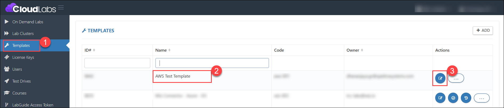
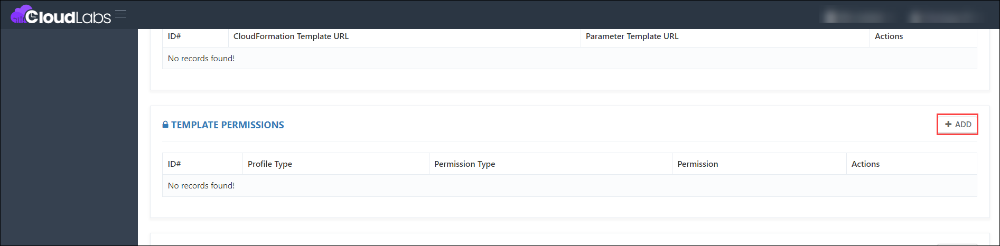
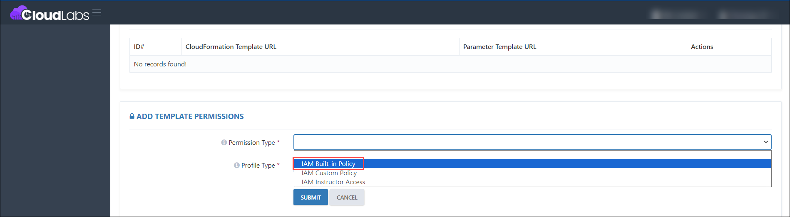
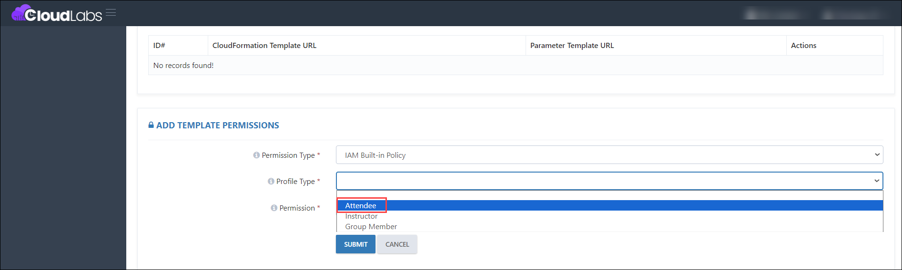
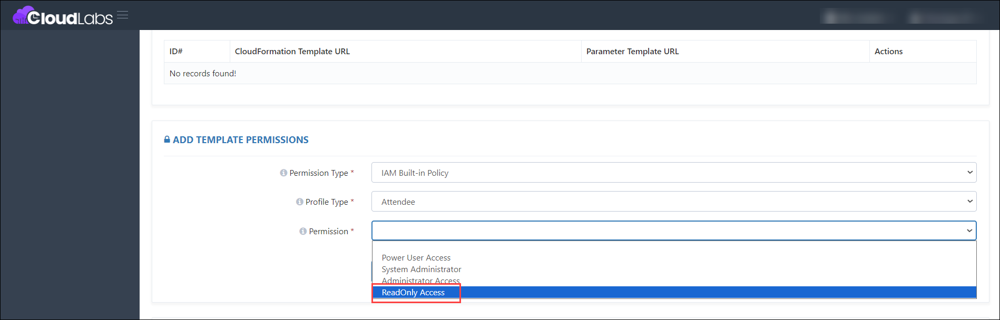
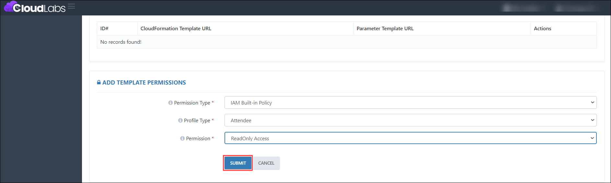
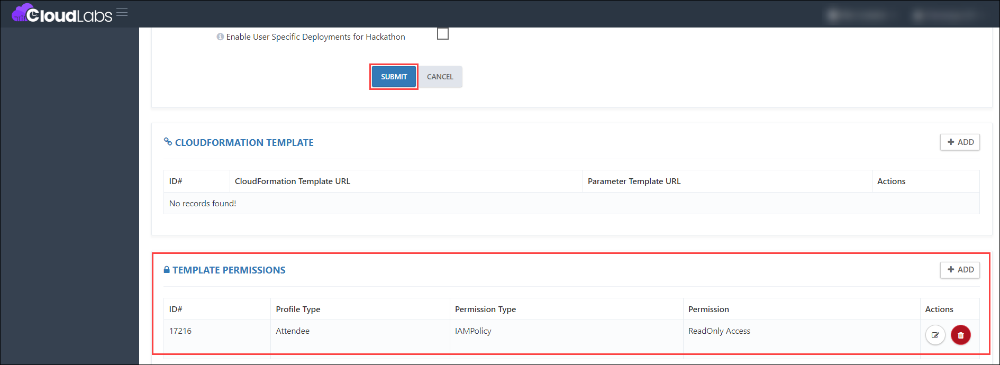

# Adding a ReadOnly Access Permission to the Template

### Overview

CloudLabs Template is the base of the hands-on lab environment. You can do a variety of configurations under Templates, such as adding pre-requisites, enabling ReadOnly Access Permission, custom policies for users, and much more. 

Here we will learn more about how to add ReadOnly Access Permission using the CloudLabs Template.

### Prerequisites

Before you begin adding ReadOnly Access permission, ensure you have the following prerequisites:

1. Admin access to [CloudLabs Admin Portal](https://admin.cloudlabs.ai/) (If access is unavailable, kindly reach out to your point of contact or [CloudLabs Support](https://docs.cloudlabs.ai/RequestSupport)).

### Add a ReadOnly Access Permission to the Template

1. Log in to the CL portal and navigate to the required tenant (WIZ). On the left-hand side of the page, you will see the Template section.

2. Navigate to the **Templates (1)** section in the left menu (1), select an **existing template (2),** and click the **Edit button (3)** in the Template section.

   

3. Then scroll down to the Template Permissions section and click on the **Add** button.

   

4. Under Permission type, select **IAM Built-in Policy** from the drop-down.

   

5. Under Profile type, select **Attendee** from the drop-down.

   

6. Under Permission, select **ReadOnly Access** from the drop-down.

   

7. Then click on the **Submit** button.

   

8. After submitting the Template permissions, click the **Submit** button for the template.

   

### Setup Template on CloudLabs

1. Follow the below mentioned guide to Setup AWS Template on CloudLabs.  

- [Adding an AWS Template](https://docs.cloudlabs.ai/Wiz/template)  
